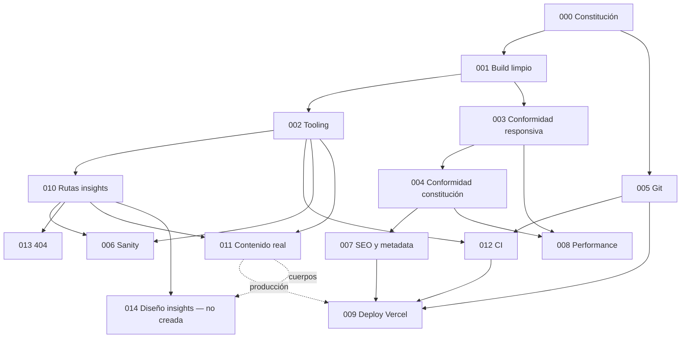

# PLAN — orden de ejecución de specs

Fecha: 2026-09-05. Base: `docs/STATUS.md` (Fase 1). Specs en `docs/specs/`.
Regla: nada se ejecuta en estado `borrador`. El dueño aprueba cambiando `Estado:` en cada archivo.

---

## 1. Grafo de dependencias

Bloqueos externos (STATUS.md §7): **B1 entorno** bloquea todo lo verificable; **B2/B3/B4/B6**
bloquean 011; **B5 diseño** bloquea 014; **B8** condiciona 005; **B9** condiciona el criterio 4
de 001; credenciales Sanity condicionan el criterio 7 de 006; acceso Vercel/GoDaddy condiciona 009.

---

## 2. Sesiones

Una sesión = lo que cabe en un contexto sin perder coherencia. Cada spec termina con su commit
`spec-NNN: <título>`, su sección Verificación pegada como evidencia y `docs/STATUS.md` actualizado.

### Sesión 0 — Solo dueño, sin Claude

| Qué                                                                                                                                                | Referencia |
| -------------------------------------------------------------------------------------------------------------------------------------------------- | ---------- |
| Mover el proyecto fuera de iCloud (`mv ~/Desktop/JCFarias ~/dev/JCFarias`, `rm -rf node_modules`, `npm ci`), o desactivar Desktop & Documents sync | B1, 000-C8 |
| Aprobar 000 (o entregar `PROMPT-CLAUDE-CODE.md` para contrastar)                                                                                   | B7         |
| Decidir: upgrade de `next` por CVE (sí/no)                                                                                                         | B9, 001    |
| Decidir: repo público (sí/no); `PROMPT-AUDIT-SPEC.md` en raíz o en `docs/`                                                                         | B8, 005    |
| Decidir: `playwright-core` como devDependency (Opción A) o script externo (B)                                                                      | 003        |
| Decidir: favicon desde wordmark (A) o `logo-primario.png` (B); aprobar texto de la imagen OG                                                       | 007        |
| Aprobar o reescribir el copy de la 404                                                                                                             | 013        |
| Cambiar `Estado: borrador → aprobada` en cada spec que se acepte                                                                                   | todas      |

**Resultado verificable:** `find node_modules -flags +dataless | head -1` vacío; `time npx tsc --noEmit` < 60 s en sitio.

### Sesión 1 — Cimientos: 001 → 005 (commit A) → 002 → 005 (commit B + push)

| Spec    | Qué deja                                                                           |
| ------- | ---------------------------------------------------------------------------------- |
| 001     | `tsc` y `next build` limpios en sitio; opcionalmente `next` parcheado              |
| 005 (A) | Commit del trabajo heredado del 2026-09-03 (dominio, handover, plan, `.gitignore`) |
| 002     | Tooling autorizado, `format:check` verde, harness Vitest committeado               |
| 005 (B) | Commit de STATUS/specs/PLAN; `git push origin main`; working tree limpio           |

**Resultado verificable:** `git status --porcelain` vacío; `git ls-remote origin main` = `HEAD`; los cinco comandos (`typecheck`, `lint`, `format:check`, `test:run`, `build`) con exit 0.
**Necesito antes:** Sesión 0 completa; decisiones B8 y B9.

### Sesión 2 — Contrato visual: 003 → 004

| Spec | Qué deja                                                                                              |
| ---- | ----------------------------------------------------------------------------------------------------- |
| 003  | `npm run audit:responsive` reproducible, 27/27                                                        |
| 004  | Solo Newsreader 300 e Instrument Sans 400/500 embebidas, sin itálica; token `xs` fuera; README al día |

**Resultado verificable:** salida de `audit:responsive` con 27 CUMPLE; `@font-face` sin `italic` y sin pesos fuera de {300, 400, 500}.
**Necesito antes:** decisión Opción A/B de 003; confirmación explícita del punto 1 de 004 (toca `layout.tsx`).

### Sesión 3 — Estructura: 012 → 010

| Spec | Qué deja                                                                                                               |
| ---- | ---------------------------------------------------------------------------------------------------------------------- |
| 012  | Workflow `ci.yml` verde en `main`; prueba negativa hecha y rama borrada                                                |
| 010  | `/insights` e `/insights/[slug]` con datos, metadata y `noindex`; `getInsight`; tipos extendidos; sin markup de diseño |

**Resultado verificable:** `gh run list` con `success`; 4 rutas 200 y una 404; `vitest` ≥ 6 tests.
**Necesito antes:** nada nuevo. (Opcional: activar protección de `main` en GitHub.)

### Sesión 4 — Superficie pública: 007 → 013

| Spec | Qué deja                                                                               |
| ---- | -------------------------------------------------------------------------------------- |
| 007  | sitemap, robots, imagen OG en ink con wordmark serif, favicon, canonical, twitter card |
| 013  | 404 con header, footer y primitivas del sitio                                          |

**Resultado verificable:** `curl` a `/robots.txt`, `/sitemap.xml`, `/opengraph-image`, `/icon` con 200; imagen OG abierta e inspeccionada; `/no-existe` 404 con chrome del sitio.
**Necesito antes:** decisión favicon A/B; texto OG aprobado; copy 404 aprobado.

### Sesión 5 — Performance: 008

**Resultado verificable:** 6 informes Lighthouse (3 móvil, 3 desktop) con medianas LCP < 2.5 s y CLS < 0.05; `soumaya-hero.jpg` ≤ 600 KB si se autoriza el re-encode.
**Necesito antes:** decidir si se re-encoda el JPG de origen.

### Sesión 6 — CMS: 006

**Resultado verificable:** `CONTENT_SOURCE=local` sigue igual (build, tests, 27/27); con credenciales, la home renderiza datos de Sanity.
**Necesito antes:** proyecto Sanity creado, `projectId`, dataset y token de lectura en `.env.local` (para el criterio 7; el resto no lo necesita).

### Sesión 7 — Deploy en preview: 009 (criterios 1–4)

**Resultado verificable:** URL `*.vercel.app` con 27/27 y rutas de 007 respondiendo.
**Necesito antes:** acceso a la cuenta Vercel (o que el dueño enlace el repo y cree la env).

### Sesión 8 — Contenido real y producción: 011 → 009 (criterios 5–8) — BLOQUEADA POR DUEÑO

**Resultado verificable:** `grep PENDING` = 0; `dig jcfarias.com` = `76.76.21.21`; `https://jcfarias.com` 200 con tarjeta OG en LinkedIn.
**Necesito antes:** transacciones en el CSV de 011; fotos con los mínimos de 011; decisión Soumaya (D4); teléfonos; acceso a GoDaddy DNS.

### Fuera del plan — 014 Diseño de `/insights` y `/insights/[slug]`

No se crea spec hasta que exista diseño aprobado (B5). Cuando exista: markup de ambas páginas,
quitar `noindex`, añadir rutas al sitemap (007), cambiar los `href` de `components/insights.tsx`
de `#insights` a `/insights` y `/insights/[slug]`, cargar cuerpos (011 formato 5).

---

## 3. Índice de specs

| Spec                                         | Título                             | Estado   | Bloqueada por dueño              |
| -------------------------------------------- | ---------------------------------- | -------- | -------------------------------- |
| [000](specs/000-constitution.md)             | Constitución                       | borrador | no (confirmar fuente, B7)        |
| [001](specs/001-build-limpio.md)             | Build limpio                       | borrador | sí (B1 entorno; B9 upgrade Next) |
| [002](specs/002-tooling.md)                  | Tooling: ESLint, Prettier y Vitest | borrador | no                               |
| [003](specs/003-conformidad-responsiva.md)   | Conformidad responsiva             | borrador | no (decisión A/B)                |
| [004](specs/004-conformidad-constitucion.md) | Conformidad de constitución        | borrador | no (confirmar cambio de fuentes) |
| [005](specs/005-git.md)                      | Git: regularizar y empujar         | borrador | sí (B8)                          |
| [006](specs/006-integracion-sanity.md)       | Integración Sanity                 | borrador | parcial (credenciales)           |
| [007](specs/007-seo-metadata.md)             | SEO y metadata                     | borrador | parcial (favicon, texto OG)      |
| [008](specs/008-performance.md)              | Performance                        | borrador | no                               |
| [009](specs/009-deploy-vercel.md)            | Deploy Vercel                      | borrador | sí (acceso; producción tras 011) |
| [010](specs/010-rutas-insights.md)           | Rutas insights (estructura)        | borrador | parcial (markup bloqueado)       |
| [011](specs/011-contenido-real.md)           | Contenido real                     | borrador | **sí, íntegramente**             |
| [012](specs/012-ci.md)                       | CI GitHub Actions                  | borrador | no                               |
| [013](specs/013-not-found.md)                | Página 404                         | borrador | sí (copy)                        |

Specs añadidas respecto al mínimo pedido: 012 (CI) y 013 (404). Motivo: 009 no debería
desplegar sin una puerta que corra fuera de la máquina afectada por iCloud, y 010 introduce
`notFound()` que hoy cae en una 404 fuera del sistema visual.
